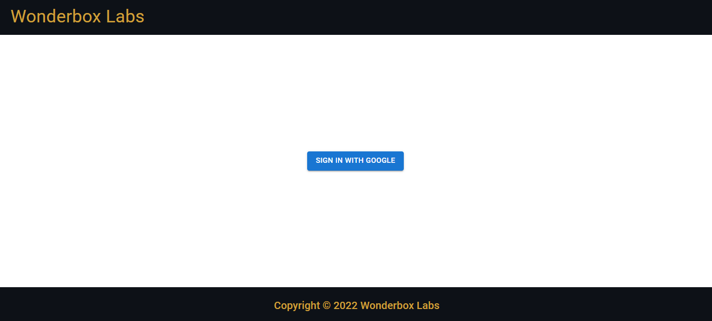
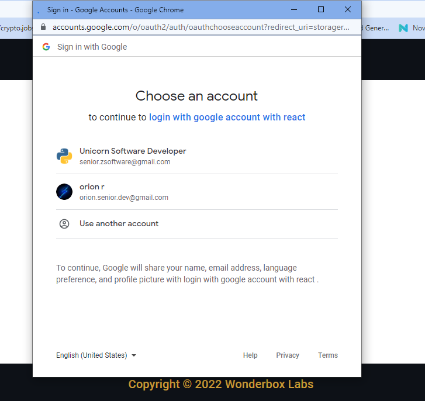
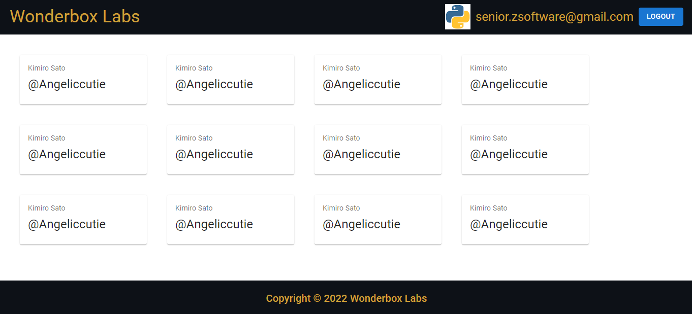

# Wonderboxlabs test assessment

## Project requirements

- Create a simple page with a header and a footer
- Add a working login button with google
- If successfully logged in fetch fake data from json place holder
- Render it in cards
- User can logout
- If successfully logout all the cards will disappear
- Use MUI only for everything

## Result view





## Scripts

First install node modules.

```
npm install
```

Next start project.

```
npm start
```

Now you can check the result in http://localhost:3000
